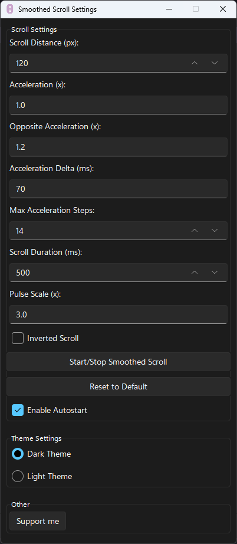

#  Smoothed Scroll

**Smoothed Scroll** is an open-source program written in Python that brings smooth scrolling to all Windows applications. With **Smoothed Scroll**, you can enjoy smooth scrolling with complete control over the settings, automatic startup, and smart game detection that disables smooth scrolling when you launch Steam games. You can also add custom exclusions for specific applications.

[](https://github.com/zachey01/SmoothedScroll/actions)
[](https://github.com/zachey01/SmoothedScroll/blob/main/LICENSE)
[](https://www.python.org/downloads/release/python-360/)

## 📝 Features

- 🖱️ **Smooth scrolling** for all Windows applications.
- ⚙️ **Full customization** of scroll behavior.
- 🚀 **Auto-start** with Windows.
- 🎮 **Auto-disable for Steam games** and customizable exclusions for other apps.
- 🔧 **Open-source** and free to use under the GNU General Public License.

## 🚀 Installation

### 📥 [Download from GitHub Releases](https://github.com/zachey01/SmoothedScroll/releases/latest/download/SmoothedScroll_Setup.exe)

### 🔧 Building from Source

If you'd like to build **Smoothed Scroll** from source, follow these steps:

#### Prerequisites:

- Python 3.12.x installed.
- `git` installed.

#### Clone the Repository

```bash
git clone https://github.com/zachey01/SmoothedScroll.git
cd SmoothedScroll
```

#### Install Dependencies

You can install all required dependencies via `pip`:

```bash
pip install -r requirements.txt
```

#### Build the Executable with Nuitka

After installing the dependencies, use **Nuitka** to build the standalone executable:

```bash
py -m nuitka --onefile main.py --enable-plugin=tk-inter --remove-output --standalone --windows-icon-from-ico=./assets/icon.ico --output-filename=SmoothedScroll --include-data-dir=./assets=./assets --include-plugin-files="assets/*" --windows-disable-console
```

This command will create a standalone executable for Windows.

## 🤝 Contributions

Contributions are welcome! Feel free to open issues, submit pull requests, or suggest features.

## ❓ FAQ

### How does **Smoothed Scroll** work?

**Smoothed Scroll** works by intercepting the scroll events in Windows applications and applying a smoothing algorithm to them. This allows for a more fluid scrolling experience compared to the default behavior. The program runs in the background and can be configured to adjust the scrolling speed and behavior according to user preferences.

### Why do antivirus programs block **Smoothed Scroll**?

Antivirus software may flag **Smoothed Scroll** as a potential threat due to its use of **Nuitka** for building the executable. Nuitka compiles Python code into standalone executables, which can sometimes resemble the behavior of malicious software. This is a common occurrence with many legitimate applications that use similar techniques. If you encounter such a warning, you can usually add an exception in your antivirus settings to allow **Smoothed Scroll** to run.

## 📸 Preview

<div style="text-align: center;">
    
</div>

---

Enjoy smoother scrolling on Windows! 🌟
